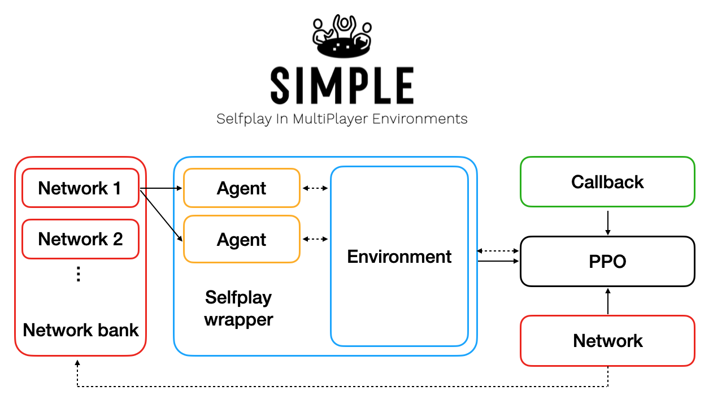
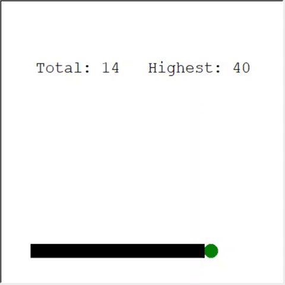
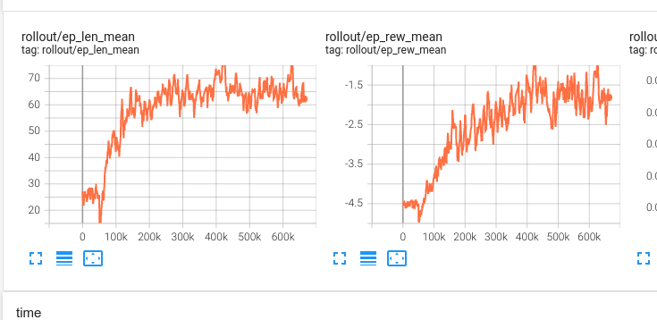
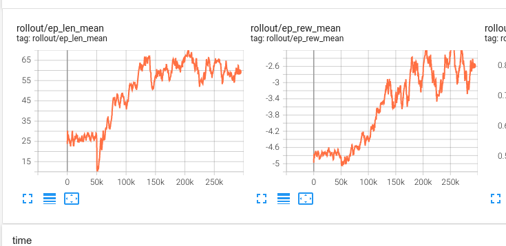

Jakub Walusiak, Juliusz Kościołek, Marcin Dohnalik

# Bot do gry Snake przy użyciu uczenia przez wzmocnienie (Reinforcement Learning)

## Pierwsze podejście: Splendor

Początkowym celem projektu było stworzenie bota grającego w grę karcianą.
Splendor jest karcianą grą strategiczną opartą na zbieraniu zasobów i wykorzystywaniu ich do dalszej ekspansji.
Uznaliśmy, że będzie ona idealnym kandydatem na wytrenowanie bota, ze względu na poniższe cechy:

- Stosunkowo proste zasady: Trenowanie bota wymaga zaimplementowania reguł środowiska, w którym będzie się on
  poruszał; im są one prostsze, tym łatwiej.
- Dość niski poziom losowości: Wysoka entropia zmniejsza skuteczność inteligentnych taktyk, bardziej premiuje proste
  szacowanie prawdopodobieństwa (przykład: wojna). Zbyt duży determinizm ogranicza zmienność gier i zmusza do
  wypracowania "jedynej słusznej" taktyki (przykład: kółko i krzyżyk)
- Emergentne mechaniki: Z prostych zasad wynikają ciekawe zależności, otwierając drogę całej gamie ciekawych i
  nieoczywistych strategii, dajemy możliwość znalezienia takiej botowi.

### Uczenie przez wzmocnienie

Przy trenowaniu botów, uczenie przez wzmocnienie jest oczywistym wyborem. Polega ono na umieszczeniu agenta w środowisku
o zdefiniowanych regułach, a następnie pozwolenie mu na wykonywanie akcji na podstawie obserwacji tego środowiska.
Środowisko może następnie karać bądź nagradzać takiego agenta za wykonane akcje. Takie podejście ma swoje plusy i
minusy:

- Do trenowania nie jest potrzebny gotowy zestaw danych — wystarczy zaimplementować zasady działania środowiska. Agent
  poniekąd sam zbiera dane, od początkowej eksploracji reguł poprzez losowe akcje, aż po tworzenie skomplikowanych
  strategii w celu maksymalizowania nagrody.
- Agent zainteresowany jest wyłącznie maksymalizowaniem nagrody (albo minimalizowaniem kary) - źle zaprojektowana
  funkcja nagrody może powodować wykształcenie niepożądanych
  zachowań ([przykład OpenAI](https://openai.com/blog/faulty-reward-functions/)).

### Self-Play

Klasyczne uczenie przez wzmocnienie bierze pod uwagę tylko agenta i środowisko, w którym działa. W jaki sposób
wykorzystać to podejście w przypadku systemów, w których agenci rywalizują ze sobą?
Rozwiązaniem tego problemu jest podejście Self-Play, zastosowane między innymi w
projekcie [Google AlphaZero](https://www.deepmind.com/blog/alphazero-shedding-new-light-on-chess-shogi-and-go).
Polega ono na trenowaniu aktualnej wersji agenta, ze swoimi poprzednimi wersjami jako przeciwnikami. Agent znajduje nowe
taktyki pozwalające pokonać szeroką gamę graczy.
Framework [`SIMPLE`](https://github.com/davidADSP/SIMPLE) pozwala na prostą implementację tego podejścia dla gier o
dowolnych zasadach.

### Gym Framework

Standardowym narzędziem do implementacji własnych środowisk dla uczenia przez wzmocnienie
jest [Gym Framework](https://github.com/openai/gym).
Główne elementy środowiska to:

- Przestrzeń obserwacji: Zbiór wszystkich obserwacji (potencjalnie nieskończony), których agent może dokonać w trakcie
  gry. Przykładowo, dla szachów
  będzie zawierał on wszystkie możliwe ułożenia figur na szachownicy.
- Przestrzeń akcji: Skończony zbiór wszystkich akcji, które agent może dokonać w trakcie gry (nie wszystkie muszą być
  zawsze dozwolone). Przykładowo, dla gry Minesweeper będzie on zawierał pozycje wszystkich pól.
- Funkcja nagrody: Na podstawie wykonanej akcji aktualizuje stan środowiska, zwraca kolejną obserwację oraz nagrodę.
- Funkcja maskująca akcje: Na podstawie aktualnego stanu środowiska zwraca aktualnie dozwolony podzbiór przestrzeni
  akcji.

### Dlaczego się nie udało?

Pod koniec implementacji mechaniki gry uświadomiliśmy sobie, że nie będziemy w stanie łatwo zintegrować jej z
paradygmatem RL. Przestrzenie obserwacji i akcji, które zaczęliśmy projektować, wydawały się bardzo skomplikowane i
ciężkie do normalizacji. Ze
względu na specyfikę gry, przestrzeń akcji mogłaby okazać się nieskończona. W tych okolicznościach uznaliśmy, że szansa
na niepowodzenie projektu jest zbyt duża i postanowiliśmy wybrać prostszy problem.

## Drugie podejście: Snake

Wyciągając wnioski z próby wytrenowania bota do gry karcianej dla wielu graczy, postanowiliśmy wykorzystać środowisko
reprezentujące typowy problem kontroli jednego agenta. Zdecydowaliśmy się na grę Snake z powodów podobnych do tych, dla
których wybraliśmy wcześniej Splendor oraz biorąc pod uwagę poprzednie doświadczenia:

- Proste zasady
- Losowość na poziomie pozwalającym na wypracowanie skutecznych strategii
- Szybko rosnący poziom trudności: Zebranie kilku pierwszych punktów jest proste, dłuższy ogon wymaga już planowania jak
  się z nim nie zderzyć.
- Jasna funkcja nagrody: Zdobycie punktu lub śmierć.
- Jasna przestrzeń obserwacji: Stan planszy.
- Jasna przestrzeń akcji: Ruch w dowolnym z 4 kierunków.

### Konstrukcja środowiska

Implementacja mechaniki gry Snake jest relatywnie prosta, jednak konstrukcja samego środowiska wymagała podjęcia decyzji
ważnych dla późniejszego treningu.

Po pierwsze, zła funkcja nagrody może spowodować niepożądane zachowania. Zbyt duże nagrody mogą powodować podejmowanie
niepotrzebnego ryzyka dla zdobycia punktu, nawet jeśli kończy się to przegraną. Zbyt niskie nagrody mogą znowu powodować
pasywność.
Zaprojektowaliśmy funkcję nagrody w następujący sposób:

1. Zdobycie punktu: 1
2. Przegrana: -10
3. Każda inna akcja: -0.01

Kluczowy jest stosunek kary 3 do nagrody 1. Definiuje on, jak bardzo karana jest pasywność. Początkowe ustawienia
oznaczają, że agent może wykonać do 100 kroków pomiędzy zdobyciami punktu, żeby wychodzić "na plus".

Po drugie, nasuwają się dwa podejścia co do przestrzeni obserwacji:

#### 1. "Lokalne"/"Subiektywne"

Agent wie, czy w danym kierunku znajduje się punkt, czy przeszkoda (ściana/ogon). To podejście wydaje się popularne
w [publicznie dostępnych materiałach dla początkujących](https://towardsdatascience.com/snake-played-by-a-deep-reinforcement-learning-agent-53f2c4331d36).

Zalety:

- Niewielka, niezależna od wielkości planszy przestrzeń obserwacji.
- Szybka nauka podstawowych zasad (poruszanie się w stronę punktu, unikanie przeszkody) dzięki praktycznie
  bezpośredniemu mapowaniu nagroda/kara kontra kierunek zawartemu w obserwacji.

Wady:

- Zbytnie ułatwienie zadania, przerzucenie większości faktycznej logiki na implementację środowiska.
- Brak szerszej świadomości sytuacji ogranicza możliwości agenta; powszechna podatność agenta do otaczania przez własny
  ogon.

#### 2. "Globalne"/"Obiektywne"

Agent widzi stan wszystkich pól planszy (tak jak człowiek grający w grę).

Zalety:

- Pełna świadomość sytuacji, możliwość zapobiegania okrążeniu przez własny ogon.
- Nie ma konieczności implementacji dodatkowej logiki przez środowisko.

Wady:

- Rozmiar obserwacji zależny od rozmiaru planszy, zmiana rozmiaru wymaga wytrenowania nowej sieci (lub wykorzystania
  uczenia transferowego)

Możliwa jest oczywiście modyfikacja obu tych podejść w celu eliminacji wad. Przykładowo, podejście "globalne", ale z
widocznością ograniczoną do `x` pól w każdą stronę od głowy eliminuje ograniczenie stałego rozmiaru, ale daje
teoretyczną szansę na otoczenie przez ogon, gdy jest on ma długość większą niż `x^2` i jest w całości poza obszarem
obserwacji.

Wybraliśmy podejście 2, ponieważ ciekawiło nas, o ile lepszy efekt możemy w ten sposób osiągnąć.
Obserwacja została znormalizowana do postaci `wysokość*szerokość*4*{0;1}` (4-elementowa tablica z wartością `1` na
pozycji odpowiadającej stanowi pola, dla każdego z pól).

### Algorytm uczenia

Trening wymaga wybrania algorytmu uczącego. Wiele z nich jest publicznie dostępnych, ale te najczęściej używane
dzielą się na dwie kategorie.

#### Q-Learning

Algorytmy klasy Q-Learning bazują na aproksymacji funkcji, która wylicza oczekiwaną nagrodę (aktualną i przyszłą) na
podstawie obserwacji i danej akcji. Jeśli znamy wartości tej funkcji dla każdej z dostępnych akcji, wystarczy wybrać tą
z największą wartością.

#### Policy Gradient

Algorytmy klasy Policy Gradient przyjmują bardziej bezpośrednie podejście i aproksymują funkcję zwracającą
najoptymalniejszą akcję dla danej obserwacji. W przeciwieństwie do Q-Learning, agent nie musi wybrać akcji z największą
nagrodą, co czasem pozwala na mniej deterministyczne zachowanie pożądane w środowiskach losowych.

Zdecydowaliśmy, że sprawdzimy skuteczność najpopularniejszych algorytmów z obu tych kategorii, Deep Q Learning (DQN)
oraz Proximal Policy Optimization (PPO). Implementacje obu algorytmów udostępnia
biblioteka [OpenAI Baselines](https://github.com/openai/baselines).

### Trenowane konfiguracje

### Najlepszy model

### Wnioski

## Dokumentacja techniczna

### Środowisko

### Konfiguracja sieci neuronowej

### Trenowanie

### Ewaluacja

## DQN: MLP(256, 256)

Obs:
tiles+direction

Reward:
-5 fail
1 food
-0.01 step

Result:
7M: -2r/60l

## DQN: CNN + MLP(64,64)

Result:
700k: -1.5r/65l

## DQN: CNN + MLP(256, 256)

Result:
300k: -2.5r/60l

## DQN: MLP(256, 256)

Reward:
-5 fail
1 food
-0.01/-0.05/-0.08 step

Obs:
tiles (normalized)

Result:
20M: -5r/75l

